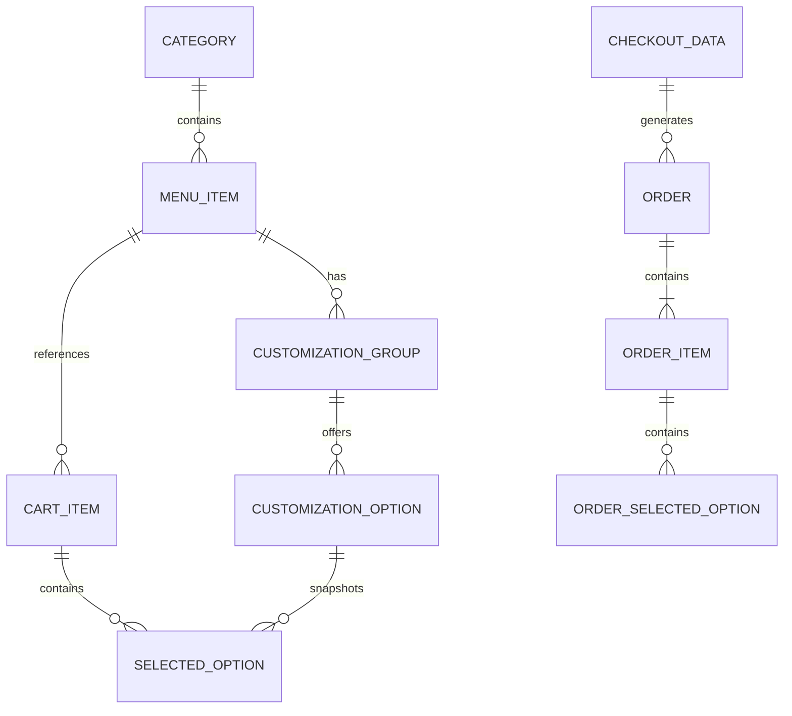

# Bite — Entidades e Relações

## 1. Objetivo

Este documento define o modelo de domínio do Bite para o MVP.

Não existe banco de dados nesta primeira versão. As entidades abaixo serão representadas por interfaces/tipos TypeScript e divididas entre:

- **dados estáticos de catálogo**;
- **estado temporário do carrinho**;
- **pedidos persistidos em `localStorage`**.

A modelagem foi feita para permitir uma implementação funcional agora e uma eventual persistência em banco de dados futuramente.

---

## 2. Visão de relações



> A relação é conceitual. No MVP os pedidos armazenam snapshots para que um pedido histórico não mude caso o catálogo seja alterado depois.

---

## 3. Category

Representa uma categoria do cardápio.

Exemplos:

- Refeições;
- Lanches;
- Massas;
- Bowls;
- Bebidas;
- Sobremesas.

```ts
export interface Category {
  id: string;
  slug: string;
  name: string;
  description?: string;
}
```

### Regras

- `id` deve ser único;
- `slug` deve ser único e adequado para URL;
- a categoria não define destaque comportamental;
- a ordenação exibida deve ser determinística.

---

## 4. MenuItem

Representa um item principal disponível para seleção no cardápio.

```ts
export interface MenuItem {
  id: string;
  slug: string;
  categoryId: string;
  name: string;
  description: string;
  basePrice: number;
  image: string;
  imageAlt: string;
  customizationGroups: CustomizationGroup[];
  available: boolean;
}
```

### Regras

- `basePrice` é armazenado em reais como número decimal no MVP;
- `imageAlt` é obrigatório para imagens informativas;
- `available: false` remove ou desabilita a compra de maneira clara;
- não existirão propriedades como:
  - `recommended`;
  - `healthy`;
  - `popular`;
  - `bestChoice`;
  - `socialProof`.

Essas propriedades não fazem parte da baseline sem nudges.

---

## 5. CustomizationGroup

Agrupa decisões de personalização.

Exemplos:

- base;
- acompanhamento;
- molho;
- adicionais;
- retirada de ingredientes.

```ts
export type SelectionMode = "single" | "multiple";

export interface CustomizationGroup {
  id: string;
  name: string;
  description?: string;
  required: boolean;
  selectionMode: SelectionMode;
  minSelections?: number;
  maxSelections?: number;
  options: CustomizationOption[];
}
```

### Regras

Para grupos obrigatórios:

- nenhuma opção vem selecionada por padrão;
- o usuário precisa realizar a escolha conscientemente;
- a UI deve explicar quando uma escolha é obrigatória.

Para grupos múltiplos:

- respeitar `minSelections`;
- respeitar `maxSelections`;
- informar o limite em texto.

---

## 6. CustomizationOption

Representa uma alternativa dentro de um grupo de personalização.

```ts
export interface CustomizationOption {
  id: string;
  name: string;
  description?: string;
  priceDelta: number;
  available: boolean;
}
```

### Exemplos

Tamanho:

```ts
{
  id: "size-medium",
  name: "Médio",
  priceDelta: 5,
  available: true
}
```

Bebida:

```ts
{
  id: "drink-water",
  name: "Água",
  priceDelta: 3,
  available: true
}
```

Na implementação atual, bebidas e sobremesas são `MenuItem` independentes. A opção acima permanece apenas como exemplo do formato de uma alternativa, não como grupo usado nos pratos.

Opções de retirada de ingrediente sempre usam `priceDelta: 0`, são opcionais e só podem citar ingredientes presentes no produto.

### Regras de baseline

Nenhuma opção deve conter:

- recomendação;
- ranking;
- comparação social;
- destaque de saúde;
- framing persuasivo;
- default.

---

## 7. SelectedOption

Representa a seleção feita pelo usuário enquanto o item está no carrinho.

```ts
export interface SelectedOption {
  groupId: string;
  groupName: string;
  optionId: string;
  optionName: string;
  priceDelta: number;
}
```

### Por que armazenar nomes e preço?

Para tornar o item do carrinho autocontido e evitar depender de múltiplas buscas no catálogo ao renderizar o resumo.

---

## 8. CartItem

Representa uma configuração específica adicionada ao carrinho.

```ts
export interface CartItem {
  id: string;
  menuItemId: string;
  menuItemName: string;
  image: string;
  imageAlt: string;
  basePrice: number;
  selectedOptions: SelectedOption[];
  quantity: number;
  unitPrice: number;
  totalPrice: number;
}
```

### Identidade do item

Dois itens do mesmo `MenuItem` podem coexistir caso tenham personalizações diferentes.

Por isso, `CartItem.id` não deve ser o mesmo que `menuItemId`.

### Cálculo

```text
unitPrice =
  basePrice
  + soma(priceDelta de selectedOptions)

totalPrice =
  unitPrice * quantity
```

O cálculo deve existir em função de domínio testável, não espalhado em componentes.

---

## 9. CartState

Estado do carrinho.

```ts
export interface CartState {
  items: CartItem[];
  updatedAt: string;
}
```

Operações:

```ts
addItem(item)
removeItem(cartItemId)
updateQuantity(cartItemId, quantity)
replaceItem(cartItemId, newItem)
clearCart()
```

### Regras

- quantidade mínima: `1`;
- ao reduzir abaixo de `1`, preferir remover explicitamente em vez de manter estado inválido;
- total é derivado dos itens;
- não persistir valores calculados contraditórios sem recalcular.

---

## 10. CheckoutData

Dados mínimos para concluir a simulação.

```ts
export type PaymentMethod =
  | "pix"
  | "card-at-counter"
  | "cash";

export type FulfillmentMethod =
  | "pickup";

export interface CheckoutData {
  customerName: string;
  fulfillmentMethod: FulfillmentMethod;
  paymentMethod: PaymentMethod;
  notes?: string;
}
```

### Decisões

Na primeira versão:

- somente retirada;
- nenhum endereço;
- nenhuma autenticação;
- nenhum dado real de cartão.

Isso mantém o protótipo focado no objetivo da disciplina.

---

## 11. Order

Representa um pedido confirmado e persistido localmente.

```ts
export type OrderStatus = "confirmed";

export interface Order {
  id: string;
  createdAt: string;
  status: OrderStatus;
  customerName: string;
  fulfillmentMethod: FulfillmentMethod;
  paymentMethod: PaymentMethod;
  notes?: string;
  items: OrderItem[];
  subtotal: number;
  total: number;
}
```

### ID

Pode ser gerado localmente com:

- `crypto.randomUUID()` internamente;
- um código curto derivado para exibição.

Exemplo visual:

```text
BITE-4F2A
```

Não usar o código curto como única fonte de unicidade interna.

---

## 12. OrderItem

Snapshot imutável do item no momento da compra.

```ts
export interface OrderItem {
  id: string;
  menuItemId: string;
  menuItemName: string;
  image: string;
  imageAlt: string;
  basePrice: number;
  selectedOptions: OrderSelectedOption[];
  quantity: number;
  unitPrice: number;
  totalPrice: number;
}
```

---

## 13. OrderSelectedOption

Snapshot de uma personalização.

```ts
export interface OrderSelectedOption {
  groupName: string;
  optionName: string;
  priceDelta: number;
}
```

O histórico não deve depender do catálogo atual para exibir escolhas antigas.

---

## 14. Relações resumidas

### Category → MenuItem

Uma categoria contém vários itens.

Um item pertence a uma categoria.

```text
Category 1 ---- N MenuItem
```

### MenuItem → CustomizationGroup

Um item pode conter zero ou vários grupos.

```text
MenuItem 1 ---- N CustomizationGroup
```

### CustomizationGroup → CustomizationOption

Um grupo possui uma ou várias opções.

```text
CustomizationGroup 1 ---- N CustomizationOption
```

### MenuItem → CartItem

O mesmo produto pode gerar vários itens no carrinho, porque cada configuração pode ser diferente.

```text
MenuItem 1 ---- N CartItem
```

### Order → OrderItem

Um pedido precisa possuir pelo menos um item.

```text
Order 1 ---- N OrderItem
```

---

## 15. Dados estáticos x persistidos

### Estáticos no código

```text
Category
MenuItem
CustomizationGroup
CustomizationOption
```

Local recomendado:

```text
src/data/menu.ts
```

### Persistidos no navegador

```text
CartState
Order[]
```

Chaves sugeridas:

```text
bite:cart:v1
bite:orders:v1
```

Usar versão nas chaves para permitir futuras migrações.

---

## 16. Invariantes do domínio

As seguintes regras nunca podem ser violadas:

1. um item indisponível não pode ser adicionado;
2. grupos obrigatórios precisam estar preenchidos;
3. limites de grupos múltiplos devem ser respeitados;
4. a quantidade deve ser inteira e maior ou igual a 1;
5. preços não podem resultar em valor negativo;
6. um pedido deve conter ao menos um item;
7. o total do pedido deve ser calculado pelo domínio;
8. pedidos confirmados são snapshots imutáveis;
9. nenhuma alternativa deve ser selecionada automaticamente na baseline;
10. não pode existir dado de pagamento sensível.

---

## 17. Funções de domínio esperadas

Criar funções puras e testáveis, por exemplo:

```ts
calculateConfiguredUnitPrice(...)
calculateCartItemTotal(...)
calculateCartSubtotal(...)
validateCustomizationSelections(...)
createCartItem(...)
createOrderSnapshot(...)
formatCurrency(...)
```

Evitar realizar esses cálculos diretamente no JSX.

---

## 18. Exemplo de fluxo de dados

```text
MenuItem
   ↓
usuário escolhe personalizações
   ↓
SelectedOption[]
   ↓
createCartItem()
   ↓
CartItem
   ↓
Zustand + localStorage
   ↓
CheckoutData
   ↓
createOrderSnapshot()
   ↓
Order
   ↓
localStorage
```

---

## 19. Modelo não incluído no MVP

Não criar sem requisito novo:

- User;
- Account;
- Address;
- Restaurant;
- Coupon;
- LoyaltyProgram;
- Recommendation;
- NutritionScore;
- TrackingEvent;
- BehavioralIntervention.

O objetivo é evitar escopo desnecessário e preservar a neutralidade da primeira versão.
